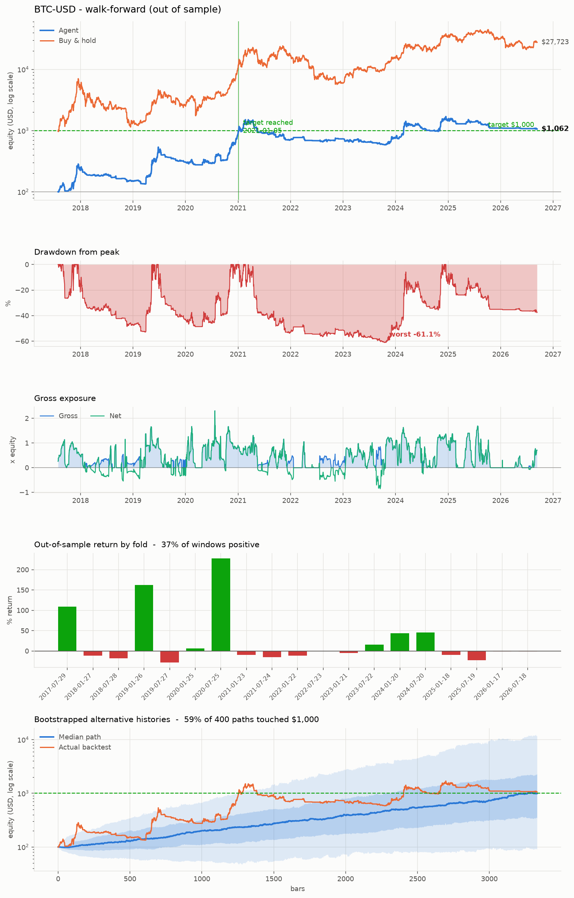
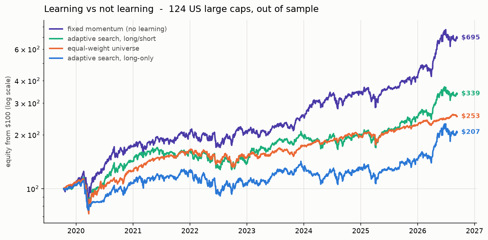

# Trading agents, backtested honestly

Two trading agents and a backtest framework built to be hard to fool.

**Part one** is a compounding agent for a single asset, built around the question that matters for a
$100 stake: *can it reach $1,000, how long does it take, and what does it have to survive on the way?*

**Part two** is a cross-sectional agent that ranks 100+ stocks against each other and learns which
factors to weight — and a measurement of whether that learning is worth anything. (Short version: on
this data it lost to a fixed rule that never learns. [Jump to it](#part-two-the-cross-sectional-agent-100-stocks-and-a-learner).)

**Part three** tests the four things that would make it real — more breadth, learning risk instead
of signal, survivorship bias, and a held-out era — plus a paper-trading harness to run it forward.
Three of the four came back against my predictions. [Jump to it](#part-three-making-it-real).

The hard part of this problem is not writing a strategy. It is writing a backtest that does not
lie to you. Two things make a backtest lie, and both are addressed structurally here rather than
by good intentions:

| The lie | What it looks like | What this repo does about it |
|---|---|---|
| **Lookahead** | using a price the decision could not have seen | a signal formed at bar `t` is filled at the **open of bar `t+1`**; every indicator, strategy and blend is proven causal by a test that truncates the future and checks the past does not move |
| **Overfitting** | trying 500 settings, reporting the winner | parameters are chosen on a **training window** and traded untouched on the **next** window; only the traded windows are reported |

Costs are charged like an exchange charges them - fee and slippage on every fill, financing on
leverage, borrow on shorts. On a $100 account that is not a detail; it is the main thing standing
between the account and the target.

> **Not financial advice.** This is research code. It backtests and it prints a recommended
> position; it never places an order. Simulated results do not predict future returns. Crypto
> routinely falls 80%. Do not trade money you cannot afford to lose completely.

---

## Quick start

### Google Colab (the intended way)

Two notebooks, each self-contained — the first cell clones this repo and installs dependencies, and
everything else runs top to bottom with no API keys and no account:

- `notebooks/Trading_Agent_Backtest.ipynb` — part one, the single-asset agent (Coinbase data)
- `notebooks/Cross_Sectional_Stock_Agent.ipynb` — part two, 124 stocks and the learner (Yahoo data)
- `notebooks/Making_It_Real.ipynb` — part three, breadth / risk learning / survivorship / holdout / paper trading

```
https://colab.research.google.com/github/Blobby132/Trading-agent/blob/claude/trading-agent-backtest-sih2te/notebooks/Trading_Agent_Backtest.ipynb
https://colab.research.google.com/github/Blobby132/Trading-agent/blob/claude/trading-agent-backtest-sih2te/notebooks/Cross_Sectional_Stock_Agent.ipynb
```

If that link does not resolve (the branch name contains slashes, which some Colab URL forms
mishandle), open Colab, choose **File -> Open notebook -> GitHub**, enter `Blobby132/Trading-agent`,
pick the `claude/trading-agent-backtest-sih2te` branch, and select the notebook.

### Locally

```bash
pip install -r requirements.txt

# walk-forward backtest of a $100 account chasing $1,000
python -m tradingagent.cli --symbols BTC-USD --capital 100 --target 1000

# a portfolio sharing the same $100
python -m tradingagent.cli --symbols BTC-USD ETH-USD LINK-USD --candidates 200

# rank 124 US large caps against each other, learning the factor weights as it goes
python -m tradingagent.cli --mode cross-section --universe us_large_cap --capital 100

# paper-trade it forward - the only holdout nobody has spent
python -m tradingagent.paper init --capital 100 --universe us_large_cap
python -m tradingagent.paper rebalance
python -m tradingagent.paper report

# no network? the synthetic simulator exercises the whole pipeline offline
python -m tradingagent.cli --source synthetic --symbols SYN --mode single

pytest -q          # the causality and accounting tests
```

The CLI writes `results/tearsheet.png`, `results/equity.csv`, `results/folds.csv` and
`results/stats.json`.

---

## What the agent actually is

An **ensemble with adaptive weights**, not a single rule. Six strategies run side by side; at
every bar the agent scores each one on its own trailing, hypothetical P&L - using only
information available at that bar - and blends their signals with a softmax of those scores. A
model that stops working loses funding within weeks without anyone intervening.

```
         data ──► indicators ──► six strategies ──► adaptive blend ──► regime filter
                                                                            │
                                                                            ▼
                                                                       risk layer
                                                      (vol targeting, leverage cap, ATR stops,
                                                       drawdown kill switch)
                                                                            │
                                                                            ▼
                                                                    execution engine
                                                       (fills at next open, fees, slippage,
                                                        financing, compounding, ruin)
```

**The strategies** (`tradingagent/strategies.py`)

| Strategy | Thesis | Shines when |
|---|---|---|
| `ema_trend` | EMA spread, gated by ADX | sustained directional moves |
| `donchian` | channel breakout, shorter exit channel | expansions out of consolidation |
| `ts_momentum` | trailing return, ranked against its own history | persistent drift |
| `bollinger_breakout` | expansion out of a volatility squeeze | regime changes |
| `mean_reversion` | fade stretched z-scores when ADX is low | ranging, choppy markets |
| `rsi_pullback` | buy dips inside an uptrend | shallow corrections in a bull run |

Two of those are counter-trend and four are with-trend on purpose: the blend should have
something to say whichever regime shows up, and the weighting decides which.

**The risk layer** (`tradingagent/risk.py`) turns a direction into a size: volatility targeting
so a quiet regime is not under-traded and a violent one does not wipe the account, a hard
leverage cap, ATR stops, and a drawdown kill switch that flattens the book and stands aside for
a cooldown.

**The engine** (`tradingagent/engine.py`) is a bar-by-bar loop rather than a vectorised dot
product, because three things it must model are path dependent: compounding, intrabar stops, and
that kill switch.

---

## Why the walk-forward is the only number worth quoting

```
|<--- train 730 bars --->|<-embargo->|<-- trade 182 bars -->|
                                   |<--- train 730 bars --->|<-embargo->|<-- trade 182 -->|
                                                          (equity carries across windows)
```

On each training window the optimiser samples configurations - which strategies, how to blend
them, how much volatility to target, how much leverage, how wide the stops - and scores them on
a growth objective that **penalises deep drawdowns quadratically and disqualifies any candidate
that drew down more than 45% in training**, however good its return. The best few are then
*averaged* and traded, untouched, over the following six months. Averaging the top-k rather than
picking the single winner is what stops one lucky parameter cell from becoming the strategy.

The stitched equity curve is a single continuously-compounding account, which is exactly what
the $100 -> $1,000 question is about.

Three further checks ship with it, because a walk-forward can still flatter a search this wide:

- **Seed sensitivity** - the search is random; if the result needs one particular seed, it is not a result.
- **Block bootstrap** (`metrics.monte_carlo_paths`) - resamples the realised out-of-sample returns
  in blocks, preserving streaks and volatility clustering, to estimate `p(reach target)` and,
  more importantly, `p(ruin)`.
- **Deflated Sharpe** (`metrics.deflated_sharpe`) - how much of the Sharpe survives after
  accounting for how many configurations were tried.

---

## Results

All figures are **out of sample**: at every point on the curve, the parameters being traded were
chosen only from earlier data. Every number here was re-measured on the current code after the
look-ahead audit below. Reproduce with
`python -m tradingagent.cli --symbols BTC-USD --capital 100 --target 1000 --candidates 150`.



The fold bars in that fourth panel are the honest summary of this whole part: **only 37% of the
nineteen six-month test windows were positive**, and three of them carry the entire result.

### Headline - BTC-USD daily, traded 2017-07-29 -> 2026-09-12, five random seeds

| | Agent (median of 5 seeds) | Buy & hold |
|---|---|---|
| Final equity from $100 | **$1,026** (range $706 - $1,390) | $2,857 |
| Reached $1,000 | **5 of 5 seeds**, between 2021-01-02 and 2021-02-08 | yes |
| Sharpe | 0.84 | - |
| Max drawdown | -52% | **-84%** |
| Calmar | 0.51 | - |
| Trades / costs paid | 1,051 / $146 | 1 / $0.10 |

Buy & hold made more money and took an 84% drawdown to do it — on a $100 account that is the
difference between a position you keep and one you capitulate out of. That trade-off, not the
absolute return, is the claim this part makes.

> **A correction.** Earlier versions of this table reported buy & hold at $27,720. That was a
> buy-and-hold curve *starting in 2015* compared against an account that starts trading in 2017 —
> not the same window, and it silently credited the benchmark with everything it made before the
> strategy existed. `metrics.summarize` now rebases any benchmark to the same start date and
> starting capital, with a test pinning it. Every benchmark figure below is the rebased one.

### The caveat that matters more than the headline

The same pipeline, run on histories that start in later years (three seeds each, 60 candidates per
fold; buy & hold over the same traded window):

| History starts | Agent (median of 3 seeds) | Reached $1,000 | Buy & hold |
|---|---|---|---|
| 2015-07 | **$1,181** | 2 / 3 | $2,766 |
| 2017-01 | $532 | 0 / 3 | $2,125 |
| 2018-01 | $375 | 0 / 3 | $940 |
| 2019-01 | **$97** | 0 / 3 | $191 |
| 2020-01 | $115 | 0 / 3 | $184 |
| 2021-01 | $133 | 0 / 3 | $442 |
| 2022-01 | $121 | 0 / 3 | $165 |

**Essentially all of the growth came from two crypto bull markets.** No run whose trading begins
after 2020 reaches the target, and the one starting January 2019 ends below its stake while BTC
itself roughly doubled.

Diagnosing that shortfall on the 2019-start window (traded 2021-01 → 2026-09):

| | Final equity from $100 |
|---|---|
| Walk-forward, normal costs | $67 |
| Walk-forward, **zero** fees and slippage | $71 |
| Fixed default config, no search | $71 |
| Long-only search | $86 |
| Buy & hold | $191 |

Costs explain about $4 of it. And the search is now marginally *worse* than the fixed configuration
($67 vs $71) — which is the same result part two finds at much larger scale: on this data the
selection step costs more than it earns. What changed underneath is the signal itself: **trend
following on daily BTC bars had a strong edge through 2021 and a much weaker one since.**

### Markets the method was never tuned on

The pipeline was developed against BTC, so BTC results carry my own selection bias that no
walk-forward removes. Pointing the identical code at four other markets is the corrective
(benchmarks rebased to the traded window):

| Market | Agent | Buy & hold | Sharpe |
|---|---|---|---|
| ETH-USD | **$947** | $452 | 0.89 |
| SOL-USD | $135 | $611 | 0.45 |
| LINK-USD | $89 | $57 | 0.05 |
| DOGE-USD | $142 | $137 | 0.54 |

ETH is the clearest win — roughly double buy & hold over the same window, at Sharpe 0.89. LINK beats
a buy & hold that lost money, DOGE is a tie, and SOL is a clear loss. Two wins, one tie, one loss
across four markets it was never tuned on is weak-positive evidence, not a vindication.

### Pushing harder toward the target

Same walk-forward, varying only the volatility target and leverage cap:

| Target vol | Max leverage | Final equity | Max drawdown | Bootstrap p(ruin) |
|---|---|---|---|---|
| 0.30 | 1.0x | $398 | -24% | 0% |
| 0.50 | 1.5x | $806 | -38% | 0% |
| 0.50 | 2.0x | $887 | -41% | 0% |
| 0.80 | 2.0x | $2,550 | -47% | 0% |
| 0.80 | 3.0x | $2,747 | -54% | 0% |
| 1.20 | 3.0x | $4,212 | -65% | 0% |

**Do not read that `p(ruin)` column as a safety guarantee.** A block bootstrap of daily returns
cannot produce a crash worse than the worst stretch already in the sample, and the engine models
neither exchange liquidation, nor funding spikes, nor a gap that blows through a stop overnight.
Real ruin risk at 3x leverage on daily crypto is meaningfully above zero; the column says only that
nothing *in this sample, reshuffled* killed the account.

### Robustness

- **Block bootstrap** of the realised out-of-sample returns (5,000 resampled histories):
  58.8% reach $1,000, median final equity $957, 5th percentile $92, 95th percentile $12,321,
  typical worst drawdown -59%.
- **Deflated Sharpe: 0.15 - 0.44**, counting 150 distinct configurations at the optimistic end and
  2,850 evaluations at the pessimistic end. Below 0.5 at both ends, which is the honest verdict:
  **an observed Sharpe of 0.84 over this sample is within what a search this wide could produce
  from noise alone.** The equity curve may still reflect something real; this statistic does not
  establish that it does.

### What to take from this

The framework does its job — it is hard to fool, and it says clearly when there is nothing there.
The strategy inside it earned a 10x over a decade containing two of the largest bull markets in any
asset class, and close to nothing since. If you fund this, fund it as a leveraged,
drawdown-controlled bet on crypto trends resuming — not as a machine that turns $100 into $1,000 on
a schedule.

## Part two: the cross-sectional agent (100+ stocks, and a learner)

The single-asset agent above asks *"will BTC go up?"* — a question whose answer is mostly the
market's move, which is why its edge is so hard to separate from noise. The second agent asks a
different one: **"which of these 124 names will beat the others?"** The market component cancels,
and one universe gives 124 comparisons a day instead of one forecast.

It is also the design the "let it try strategies and keep what works" idea actually needs. Three
models compete, in increasing order of how much they learn:

| Model | Learns? | What it is |
|---|---|---|
| `mom_only` | no | one factor: 12-month momentum, skipping the last month |
| `equal_blend` | no | fixed signed blend of all eleven factors |
| `ridge` | **yes** | fits factor weights on each training window, refitted every fold |

Every six months the loop refits, rescores all three, and trades the best few — coefficients *and*
model choice are re-decided. That is the adaptive agent, made concrete.

```bash
python -m tradingagent.cli --mode cross-section --universe us_large_cap --capital 100
python -m tradingagent.cli --mode cross-section --universe crypto_majors --source coinbase --allow-short
```

### The result: the agent that learns lost to the rule that does not



124 US large caps, out of sample 2019-10-14 → 2026-09-11, $100 start, 5 bps fee + 3 bps slippage
per side:

| Strategy | Learns? | Final | Sharpe | Max drawdown |
|---|---|---|---|---|
| **fixed momentum, top decile, monthly** | no | **$695** | 1.11 | -32% |
| fixed momentum, top quintile, monthly | no | $387 | 0.94 | -32% |
| adaptive search, long/short | **yes** | $336 | 0.79 | -35% |
| equal-weight universe (benchmark) | no | $253 | 0.79 | -36% |
| fixed equal blend, long-only | no | $239 | 0.71 | -31% |
| **adaptive search, long-only** | **yes** | **$205** | 0.53 | -32% |
| fixed momentum, long/short | no | $88 | -0.09 | -35% |
| fixed equal blend, long/short | no | $63 | -0.49 | -46% |

And it is not a lucky cell. Sweeping the whole neighbourhood — four momentum definitions × three
concentration levels × three rebalance frequencies, 36 fixed variants:

- median final equity **$315**, range $211 – $719
- **100%** of them beat the adaptive long-only agent ($205)
- **81%** beat the equal-weight benchmark ($253)

### Why the learner lost

Not a bug, and not a bad implementation. The reason is structural, and it is the same one that
sank the deflated Sharpe in part one:

1. **The selection step has its own error, and here it exceeds its benefit.** Choosing among 50
   candidates on three years of noisy data, fourteen times over, is fourteen chances to pick
   whatever got lucky in-sample. The deflated Sharpe for the adaptive runs is **0.04 – 0.42** —
   below 0.5 at both ends.
2. **Momentum is a strong prior; three years of data is a weak one.** The fixed rule encodes three
   decades of published evidence. The ridge model re-derives it badly from each window, and
   sometimes derives something else — the per-fold coefficient heatmap in the notebook shows the
   learned weights moving around (mean consecutive correlation 0.49 long-only, 0.63 long/short).
3. **Adaptation costs turnover.** Each time the chosen model changes, the book turns over. The
   fixed rule's positions persist.

The one place selection clearly earned its keep: in the **long/short** arm it returned $336 against
$88 and $63 for the naive fixed long/short rules. There the configurations it was choosing between
were genuinely bad, and picking among them mattered.

### What I would build next, given this

The lesson is not "don't learn". It is **learn what is estimable, and take priors for what is not**:

| Estimable from a few years | Not estimable from a few years |
|---|---|
| volatility, correlation, beta | which factor has an edge |
| transaction costs, capacity | the sign of a weak signal |
| position sizing, risk budgets | whether this regime is different |

So: fix the factor set from the literature, and point the learning at **risk** — volatility
targeting, correlation-aware sizing, drawdown control — where a few years of data genuinely does
contain the answer. Then add breadth: information ratio scales with the square root of the number
of independent bets, and that is the only lever here with no statistical catch.

### Practical constraints at $100

- **Long/short is the version cross-sectional strategies are built for, and a $100 US cash account
  cannot run it.** Shorting requires margin (Reg T minimum $2,000); more than three day trades in
  five days triggers the pattern-day-trader rule ($25,000). The long-only path is the one that is
  actually available, which is why it is the default.
- **Fractional shares are mandatory.** $100 across twelve names is $8.33 each — not one whole share
  of most large caps.
- Liquid large caps only: a small-cap spread would eat the account.

### Data caveats specific to this part

- **Survivorship.** `US_LARGE_CAP` is a list of names that are liquid *today*. It deliberately
  includes conspicuous laggards (INTC, BA, GE, PFE, T, VZ, CVS, PARA) rather than only winners, and
  a ranking model is far less exposed than a long-only one — the bias lifts all names roughly
  equally. It is still there. Point-in-time index membership is the only real fix and no free
  source provides it.
- **The numbers above use the Nasdaq fallback**, which is split-adjusted but *not*
  dividend-adjusted, because Yahoo rate-limited the machine these were measured on. That
  understates high-yield names (utilities, telecoms, energy) by a few percent a year — a systematic
  cross-sectional tilt, not noise. The notebook defaults to Yahoo's total-return adjusted closes,
  so your run will differ, and should be trusted over these.

---

## Part three: making it real

Parts one and two produced a strategy and a warning. Part three does the four things that decide
whether any of it survives contact with reality — and three of the four came back **against** what
I predicted.

| Question | Prediction | Result |
|---|---|---|
| Does more breadth help? | yes — the one lever with no statistical catch | **no** — 381 names did worse than 124 |
| Does learning *risk* help where learning *signal* failed? | yes | **mostly no** — only the drawdown guard earned its place |
| How much is survivorship bias worth? | it inflates the strategy | **it inflates the benchmark twice as much** |
| Does the rule hold on a reserved era? | probably | **yes — the strongest result in the repo** |

`notebooks/Making_It_Real.ipynb` runs all of it.

### Breadth did not help

Same fixed momentum rule, two universes, same out-of-sample window:

| Universe | Final | Sharpe | Max drawdown | Equal-weight benchmark |
|---|---|---|---|---|
| 124 names | **$682** | 1.10 | -33% | $253 |
| 381 names | $426 | 0.92 | -37% | $240 |

My argument was that information ratio scales with the square root of the number of independent
bets. That argument has a hidden assumption — **equal skill per bet** — and the names I added did
not carry the same signal. More bets at a lower hit rate is not an improvement. Breadth is worth
having when the *marginal* name is as good as the average one; test that rather than assuming it.

### Learning risk did not help either, with one exception

Signal held fixed; only the sizing learned. Each layer switchable, so they can be attributed
rather than shipped as a bundle:

| Layer | Final | Sharpe | Max drawdown | Calmar | Volatility |
|---|---|---|---|---|---|
| no risk learning (baseline) | **$426** | 0.92 | -37.2% | 0.63 | 26.6% |
| inverse-vol allocation | $345 | 0.86 | -35.9% | 0.55 | 24.3% |
| correlation scaling only | $355 | 0.86 | -35.4% | 0.57 | 24.9% |
| **drawdown guard only** | $309 | 0.84 | **-26.6%** | **0.67** | 22.5% |
| vol target 25% only | $312 | 0.82 | -32.3% | 0.56 | 23.5% |
| everything on | $238 | 0.73 | -24.0% | 0.56 | 20.0% |

Only the drawdown guard improved return per unit of drawdown (Calmar 0.67 vs 0.63), cutting the
worst drawdown from -37% to -27%. Everything else cut return roughly in proportion to the risk it
removed.

The reason is period-specific and worth naming: **risk layers de-risk into volatility, and in
2019–2026 every volatility spike was followed by a sharp recovery.** In a market that keeps
V-recovering, cutting into drawdowns is a tax. In 2008 it would have been insurance. One sample
cannot tell you which regime you are in, and that uncertainty is the argument for keeping the
drawdown guard despite its cost.

> One finding in this table was originally my own arithmetic. The correlation scale had the
> diversification ratio inverted and collapsed a 27%-volatility book to 3%, which looked like a
> dramatic result about risk management. It is fixed, with two tests pinning it — a normal book
> must not be rescaled, and the scale must still react when correlation genuinely spikes.

### Survivorship bias runs the other way

`survivorship.py` converts "there is some bias" into a number. Where the dead names are available
it measures the gap directly; where they are not (Nasdaq's quote API serves none of them) it
injects synthetic failures — names faded to near-zero and then delisted, concentrated where real
failures concentrate — and damages the benchmark identically so the relative column isolates what
failures cost the strategy specifically.

| Annual failure rate | Strategy | Benchmark | Strategy drag | Benchmark drag | Relative |
|---|---|---|---|---|---|
| 0% | $426 | $237 | — | — | — |
| 1% | $368 | $173 | -13.7% | -27.3% | **+9.9%** |
| 2% | $320 | $127 | -25.0% | -46.4% | **+20.9%** |
| 4% | $205 | $54 | -52.0% | -77.0% | **+29.8%** |

**Hidden failures cost the benchmark roughly twice what they cost the strategy**, because failing
companies are almost never sitting in the top momentum decile. So survivorship bias flatters the
*benchmark* more than the strategy, and the measured outperformance is if anything understated —
the opposite of the usual worry. Realistic large-cap failure rates are around 1%/yr, so that row is
the one to read.

### A held-out era, and a ledger that counts your looks

`holdout.py` hides a reserved era from the development split, and records every evaluation against
it in a file. A second look is not forbidden; it is counted, and the verdict changes. An era
checked eleven times is not held out, and the ledger stops that fact from quietly disappearing.

Fixed 12-1 momentum, top decile, monthly, on 2024-01 → 2026-09 — an era never used to tune it:

| | Reserved era |
|---|---|
| Final equity from $100 | **$279** |
| Sharpe | **1.49** |
| Max drawdown | -22.6% |
| Equal-weight benchmark | $146 |

The strongest result in this repo, from the simplest rule in it. **With one honest caveat:** I ran
experiments across 2024–2026 throughout this project, so it is not a virgin holdout *for me*. What
is true is that the momentum rule itself was never tuned — it is the textbook specification,
unchanged since it was written.

### Paper trading — the only holdout nobody has spent

```bash
python -m tradingagent.paper init --capital 100 --universe us_large_cap
python -m tradingagent.paper rebalance     # monthly: prints orders, records fills at next open
python -m tradingagent.paper report        # live vs backtest
```

State is one JSON file. Orders are sized on the last close and filled at the next open — the same
convention the engine uses, so the two stay comparable.

The report puts **tracking error** and **return correlation** above P&L on purpose. A paper account
that makes money while behaving nothing like its backtest has told you the backtest is wrong, not
that the strategy works — and that is the failure you most need to catch early, because it is the
one that looks like success.

### What the whole project adds up to

Across three parts, the thing that kept winning was the simplest rule in the repo: **rank on
12-month momentum, hold the top decile, rebalance monthly, never adapt.** Every layer of
intelligence added on top — adaptive strategy selection, learned factor weights, learned risk
sizing, more breadth — made it worse.

The machinery built to test those ideas was not wasted. It is what let each of them be rejected on
evidence rather than taste, and it is what found four correctness bugs and two reporting errors in
my own work along the way.

**What to do now, in order:**

1. **Paper-trade the fixed rule for six months** and watch the tracking error. It is the only
   remaining test that nothing in this repo can fool.
2. **Get total-return, point-in-time data** before funding anything. Every result here rests on a
   universe assembled by hindsight; that is the last big uncontrolled variable.
3. **Resist adding features.** On this evidence the next one is more likely to cost than pay.
   Change that only when a specific addition beats the fixed rule on an era you reserved *before*
   you built it.

---

## Methodology

Read this before any number in this repository. It states what the framework
assumes, so results can be judged rather than taken.

### Execution timing — one canonical model

```
bar T closes
  └─ the strategy sees information available at T's close
       └─ target weights are produced
            └─ orders are scheduled
                 └─ bar T+1 opens
                      └─ orders fill at T+1's execution price
                           └─ the book is marked at T+1
```

The lag is **one bar, always**, in the backtest and in paper trading. A weight
formed on bar `T`'s close can never transact at that close.
`tradingagent/execution.py` is the single definition; `engine.py` and `paper.py`
both call it, and `tests/test_execution_parity.py` asserts their equity curves
match exactly under every cost scenario.

Order sizing uses the **execution reference price**, which models a *notional*
(fractional-share) order: you ask for $8.33 of a name and the broker fills that
dollar amount at whatever the opening print is. It is **not** valid for
whole-share orders, where a share count must be committed before the open. At
the account sizes this framework targets, fractional shares are a hard
requirement anyway.

### Cost assumptions

Four components, charged as an **adverse fill price** rather than a rebate from
cash, so the recorded trade price is what was actually paid:

| Component | LOW | **BASE** | HIGH |
|---|---|---|---|
| fee (commission) | 2.0 bps | **10.0 bps** | 20.0 bps |
| half-spread | 1.0 | **2.5** | 7.5 |
| slippage | 1.0 | **2.5** | 7.5 |
| market impact at full participation | 0 | **0** | 50 (√-law) |
| **total per side** | **4 bps** | **15 bps** | **35 bps +impact** |
| financing on leverage | 5%/yr | **8%/yr** | 12%/yr |
| borrow on shorts | 6%/yr | **10%/yr** | 15%/yr |

BASE is the default and reproduces the framework's historical assumption
(`fee_bps=10` + `slippage_bps=5`) exactly, so adopting the model moved no
published number. Impact is zero in LOW and BASE because at $100–$10,000 of
notional, participation in a liquid name is indistinguishable from zero — turn
it on before believing any capacity claim.

Run `--cost-scenario low|base|high`. **A strategy that only works under LOW is
fragile**, and the robustness battery says so explicitly.

### Walk-forward

```
|<--- train --->|<-embargo->|<-- trade -->|
                          |<--- train --->|<-embargo->|<-- trade -->|
                                        (equity carries across windows)
```

Parameters are chosen on the training window and traded untouched on the window
that follows. Three guards keep the test period out of the fit: the fit sees
only training bars; observations whose forward return resolves after the
training window are **purged**; and an embargo separates the two so rolling
features cannot smear across the join.

### The search space, and why it shrank

The default space is **2,304 combinations across nine economically motivated
parameters** — what to trade, which way, how much, when to stop. Nuisance knobs
that exist only because some function needed a number are pinned.

It used to be **20 parameters and 3.3 billion combinations**. Searching a space
that large over ~3,300 bars is a machine for finding coincidences, and it is why
the deflated Sharpe kept landing below 0.5. The old space survives as
`LEGACY_WIDE_SEARCH_SPACE` for reproducing prior results.

### Holdout

`holdout.py` splits history into a development era and a reserved one. Both
optimisers accept a `holdout=` argument and **raise** if handed reserved bars,
rather than quietly training on data that is supposed to be unseen — the one
failure mode that leaves no trace in the output afterwards. Every evaluation
against the reserved era is recorded in a ledger, and the verdict degrades with
each look: an era checked eleven times is not a holdout.

### The research ledger

`ledger.py` records every run: period, universe, parameters, seed, cost
scenario, objective, results, and whether the result was used to **select**
anything. `selection_count()` sums candidates across every selecting run, and
that total — not one search's count — is what belongs in a multiple-testing
correction. The searches you ran last week still happened.

### Robustness

`python -m tradingagent.cli --mode robustness` runs the battery: cost scenarios,
extra slippage, wider spreads, seeds, start and end dates, and an alternative
fill model, scored against stated acceptance floors (Sharpe ≥ 0.3, drawdown no
worse than −40%, at least 20 trades). `parameter_stability` re-evaluates a
chosen configuration at nearby values and flags spikes; `regime_report` splits
performance by trend, volatility and drawdown events.

### How to read a result

These are four different claims, and the repository labels them separately:

| Label | What it means | How much it is worth |
|---|---|---|
| **backtest** | fitted and evaluated on the same data | almost nothing on its own |
| **out-of-sample** | walk-forward; parameters chosen only on earlier data | real, but subject to multiple testing |
| **holdout** | an era reserved before building, checked once | the strongest historical evidence available |
| **paper** | traded forward without money | the only evidence nothing in this repo can fool |
| **live** | real money | not implemented here, deliberately |

Nothing in this repository is a claim that the strategy is profitable. The
framework's job is to make it hard to believe that by accident.

### Known limitations

- **The universe is not point-in-time.** `US_LARGE_CAP*` lists names liquid
  *today*. `MembershipProvider` is the interface that fixes this and
  `PointInTimeMembership` implements it — what is missing is the data, which no
  free source publishes. `StaticMembership.describe()` says so out loud.
- **Delisted names are absent** from the Nasdaq source entirely, because it is a
  live-quote API. Yahoo serves most of them.
- **Dividends** are included via Yahoo's adjusted closes and **excluded** from
  the Nasdaq fallback, which understates high-yield names by a few percent a year
   — a systematic cross-sectional tilt, not noise.
- **Market impact is off by default**, so no capacity claim is supported.
- **Kelly sizing is disabled by default** and should stay that way until there is
  evidence to justify it.
- **The 2019–2026 sample is overwhelmingly bullish.** The regime report shows
  only ~2% of bars in a bear trend and ~1.6% in a benchmark drawdown past 20%,
  so any statement about how the strategy behaves in a bear market rests on
  almost no data.

---

## Look-ahead audit

Look-ahead is the failure that makes a backtest worthless while looking excellent, so it gets its
own test file and its own audit rather than a line of reassurance.

### How it is tested

`tests/test_no_lookahead.py` does not shorten the series to hide the future. It keeps the series
exactly as long and **replaces every bar after a cut date with garbage** — a different price level,
a different volatility, the opposite drift — then asserts that every value before the cut is
**bit-identical** (`rtol=0, atol=0`).

That is stricter than truncation, and deliberately so. Truncation catches code that indexes
forward. Poisoning also catches code whose output depends on the *values* of future bars without
depending on their count — a full-sample mean, a standardisation over the whole history, a quantile
computed once and applied everywhere. Those pass a length-based test and fail this one.

Every layer is covered: 12 indicators, all 6 single-asset strategies, the ensemble's adaptive blend
weights, the risk-sizing layer, 11 cross-sectional features raw and standardised, all three rankers,
portfolio construction, volatility targeting, the execution engine's equity path *and* its trade
log, and both walk-forward loops end to end (folds completing before the cut must be untouched,
including which model was selected).

Three negative controls prove the audit can fail: a full-sample normalisation, a `shift(-1)` signal,
and — specifically for the ridge target purge — a fit with the purge removed, which does move its
coefficients when the future is poisoned. Without that last control the purge test would pass
vacuously.

### What the audit found

| Finding | Status |
|---|---|
| **Tradeability peeked at the same bar's close.** The engine decided whether a name could be traded at bar `t`'s open by requiring bar `t`'s *close* to be finite — not knowable when the order goes in, and it let the backtest skip a name on its final day using information from the end of that day. | **Fixed.** Tradeability now depends on the open alone; marking falls back open → last print. |
| **Universe membership used the whole sample.** `min_history(bars)` keeps names by their *total* bar count, including bars that had not happened yet. | **Documented, and an alternative added.** `require_history_before(date, bars)` is the point-in-time-correct filter. The engine already skips a name that has not listed, so the total-history filter buys tidiness, not correctness. |
| Trailing stop trailed on the same bar's high it was then tested against. | Fixed earlier; regression test in `test_engine.py`. |
| **Benchmark compared across different start dates.** A buy-and-hold curve beginning in 2015 was sliced to the traded window and its *level* compared against an account starting at $100 in 2017, crediting the benchmark with everything it earned before the strategy existed. Not look-ahead in the strategy, but the same family of error: a comparison that is not one. | **Fixed.** `metrics.summarize` rebases any benchmark to the same start date and capital, with a test. Every reported benchmark was re-measured. |
| Ridge targets overlapping the test window. | Purged, with the negative control above. |
| Everything else — indicators, strategies, blending, sizing, features, rankers, both walk-forwards. | Clean under poisoning. |

### What the audit cannot fix

**The ticker list is still survivorship-biased.** `US_LARGE_CAP` names companies that are liquid
*today*; firms that were large in 2016 and then collapsed are absent. No amount of careful
time-indexing repairs that — only point-in-time index membership data does, and no free source
provides it. The list deliberately includes conspicuous laggards (INTC, BA, GE, PFE, T, VZ, CVS,
PARA) rather than only winners, and a ranking model is far less exposed than a long-only one
because the bias lifts every name roughly equally. It is still there, and it flatters the
long-only numbers in particular.

Running the audit:

```bash
pytest tests/test_no_lookahead.py -v     # 55 assertions, including the negative controls
pytest -q                                # the full suite
```

---

## Layout

```
tradingagent/
  data.py           Coinbase / Yahoo / Nasdaq / CSV loaders, disk cache, simulator
  indicators.py     causal technical features
  strategies.py     six single-asset signal generators + a registry
  agent.py          the ensemble, adaptive weighting, regime filter
  risk.py           volatility targeting, Kelly, ATR stops, drawdown kill switch
  engine.py         execution, costs, leverage, compounding, ruin, delisting
  optimize.py       single-asset walk-forward search, objectives, top-k blending
  universe.py       named universes + the wide Panel (dates x symbols)
  features.py       eleven cross-sectional factors, standardised across names
  cross_section.py  three rankers (one fixed, one blended, one learned) + sizing
  xs_optimize.py    the cross-sectional walk-forward learning loop
  metrics.py        statistics, time-to-target, bootstrap, deflated Sharpe
  report.py         tearsheet plots
  execution.py      THE canonical execution + cost model (both paths use it)
  robustness.py     parameter stability, regimes, the robustness battery
  ledger.py         research ledger: every run, and whether it selected anything
  live.py           "what should I hold right now" - single name and basket
  risk_learner.py   learning applied to sizing instead of to signal
  survivorship.py   measures the bias, or bounds it by injecting failures
  holdout.py        a reserved era, and a ledger counting every look at it
  paper.py          paper trading + the live-vs-backtest divergence report
  cli.py            command-line entry point
notebooks/
  Trading_Agent_Backtest.ipynb       part one: the single-asset agent
  Cross_Sectional_Stock_Agent.ipynb  part two: 124 stocks and the learner
  Making_It_Real.ipynb               part three: breadth, risk, bias, holdout, paper
tests/              330 tests; test_no_lookahead.py and test_execution_parity.py
                    are the causality and timing audits
```

### Configuration

Everything is a dataclass, so nothing is hidden in a function signature:

```python
from tradingagent.agent import AgentConfig, TradingAgent
from tradingagent.engine import ExecutionConfig
from tradingagent.risk import RiskConfig

agent = TradingAgent(
    AgentConfig(
        strategies=["ema_trend", "donchian", "ts_momentum"],
        weighting="adaptive",     # "equal" | "best"
        perf_lookback=120,        # bars of trailing P&L used to score a strategy
        regime_filter=True,       # veto signals that fight the long-term trend
        signal_smooth=5,
    ),
    RiskConfig(
        target_vol=0.50,          # annualised
        max_leverage=2.0,
        atr_stop_mult=6.0,        # wide on purpose - see below
        max_drawdown_stop=0.35,   # flatten and stand aside
    ),
)
result = agent.backtest(prices, ExecutionConfig(initial_capital=100.0, target_equity=1000.0))
print(result.stats())
```

Three defaults that were set by measurement rather than convention:

- **`atr_stop_mult=6.0`.** A 2-3 ATR stop sits inside daily crypto noise; it gets shaken out of
  precisely the trends the trend models exist to capture. Tight stops measurably *cost* money here.
- **`min_trade_frac=0.10`.** On a $100 account, rebalancing for the sake of a 2% weight change is
  pure fee. Ignoring small adjustments cut turnover by more than half.
- **`signal_smooth=5`.** Damps day-to-day flip-flopping in the blend, which is otherwise paid for
  in slippage.

### The kill switch bug worth knowing about

An early version latched: once equity fell past the drawdown limit it went flat, but the
high-water mark never reset, so every subsequent bar re-armed the cooldown and the agent never
traded again. The fix - restart the drawdown clock from wherever the account actually is when the
cooldown expires - is in `engine.py`, and `tests/test_engine.py::test_drawdown_kill_switch_flattens_then_resumes`
exists to keep it fixed.

---

## Honest limitations

- **The asset did the heavy lifting.** BTC rose roughly 100x over this sample. Any long-biased
  agent looks good against that backdrop. Always read the buy-and-hold column next to the agent's -
  buy & hold frequently wins on return while losing badly on drawdown, and that difference is the
  actual claim being made here.
- **I iterated on BTC.** The pipeline was developed while looking at BTC daily bars, so BTC results
  carry my own selection bias no walk-forward can remove. The cross-asset section of the notebook
  is the corrective: the same code, unchanged, pointed at markets it was never tuned on.
- **Execution is optimistic.** Fills at the open with fixed slippage; real fills on thin pairs are
  worse, and a gap through a stop is worse again.
- **A 10x needs volatility, and volatility is symmetric.** Every configuration that reaches $1,000
  quickly is also a configuration that can reach $0. That is why the bootstrap reports `p(ruin)`
  next to `p(reach target)`, and why the risk settings should be chosen by reading the first column.
- **No regime is permanent.** The adaptive blend shortens how long a broken model stays funded. It
  cannot manufacture an edge in a regime where nothing in the panel works.
